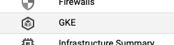
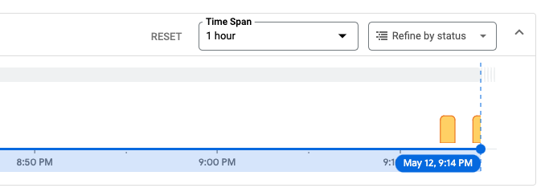
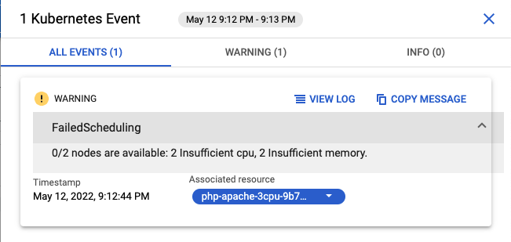

# Managed Container Platform - Software Delivery Workshop

## SAW020

![[/fragments/labmanuallogo]]

## Overview

This lab demonstrates the operational simplicity and resource optimization benefits of [GKE Autopilot](https://cloud.google.com/kubernetes-engine/docs/concepts/autopilot-overview).  This includes automatically scaling application resources based on resource and usage demands, enabling operations teams to focus on higher value tasks.

## Objectives

In this lab, you will learn how to perform the following tasks:

* Verify your environment.
* Deploy an application to your cluster.
* Automatically scale your cluster based on your application's resource needs.
* Configure autoscaling for your application.

## Setup and Requirements

![[/fragments/startqwiklab]]

![[/fragments/gcpconsole]]

1.  In the Google Cloud Console, activate Cloud Shell.

    [ACTIVATE CLOUD SHELL](https://console.cloud.google.com/?cloudshell=true&_ga=2.89525019.1226080234.1626725693-1104188948.1619545283)

    At the bottom of the Cloud Console page, a [Cloud Shell](https://cloud.google.com/shell/docs/features) session starts and displays a command-line prompt. Cloud Shell is a shell environment with the Cloud SDK and the [gcloud command-line tool](https://cloud.google.com/sdk/gcloud) already installed, and with values already set for your current project. It can take a few seconds for the session to initialize.

## Verifying your environment

You can now ensure that your GKE Autopilot cluster was created successfully in your project.

1.  Verify all clusters are running.

    ```bash
    gcloud container clusters list --format='table(name,status)'
    ```

    The output is similar to the following:

    ```output
    NAME: gke-autopilot
    STATUS: RUNNING
    ```

1.  Get cluster credentials.

    ```bash
    gcloud container clusters get-credentials gke-autopilot --zone us-central1
    ```

1.  Verify connectivity to your cluster.

    ```bash
    kubectl version
    ```

    The output is similar to the following:

    ```output
    Client Version: version.Info{Major:"1", Minor:"23", GitVersion:"v1.23.4", GitCommit:"e6c093d87ea4cbb530a7b2ae91e54c0842d8308a", GitTreeState:"clean", BuildDate:"2022-02-16T12:38:05Z", GoVersion:"go1.17.7", Compiler:"gc", Platform:"linux/amd64"}
    Server Version: version.Info{Major:"1", Minor:"22", GitVersion:"v1.22.6-gke.1500", GitCommit:"5595443086b60d8c5c62342fadc2d4fda9c793e8", GitTreeState:"clean", BuildDate:"2022-02-09T09:25:03Z", GoVersion:"go1.16.12b7", Compiler:"gc", Platform:"linux/amd64"}
    ```

Your GKE Autopilot cluster is now ready.

## Deploy an application to your cluster

Deploying an application to GKE Autopilot simply requires you to create a Kubernetes manifest for the container you want to deploy.  For this lab, we'll be using an image based on the`php-apache` image.

1.  Create a Kubernetes manifest which deploys the `php-apache` application listening on port 80.

```yaml
cat << EOF > php-apache.yaml
apiVersion: apps/v1
kind: Deployment
metadata:
  name: php-apache
spec:
  selector:
    matchLabels:
      run: php-apache
  replicas: 1
  template:
    metadata:
      labels:
        run: php-apache
    spec:
      containers:
      - name: php-apache
        image: k8s.gcr.io/hpa-example
        ports:
        - containerPort: 80
---
apiVersion: v1
kind: Service
metadata:
  name: php-apache
  labels:
    run: php-apache
spec:
  ports:
  - port: 80
  selector:
    run: php-apache
EOF

```

1.  Deploy the application using `kubectl`, which is the open source command line tool for managing Kubernetes clusters.

    ```bash
    kubectl apply -f php-apache.yaml
    ```

1.  Inspect your deployment.

    ```bash
    kubectl get deployments
    ```
    The output is similar to the following:

    ```output
    NAME         READY   UP-TO-DATE   AVAILABLE   AGE
    php-apache   1/1     1            1           30s
    ```

    <ql-warningbox>
    If you don't see 1/1 ready pods, wait a minute and try the previous command again.
    </ql-warningbox>

## Automatically scale your cluster based on your application's resource needs

Certain applications may require more CPU or memory resource than others.  GKE Autopilot automatically provisions the compute resources for your application(s) based on resource requirements you set in the deployment specification for each application.

1.  View the currently provisioned compute resources.

     ```bash
    kubectl get nodes -o=custom-columns=NAME:.metadata.name,CPU:.status.capacity.cpu
    ```
    The output is similar to the following:

    ```output
    NAME                                           CPU
    gk3-gke-autopilot-default-pool-094ee287-d05m   2
    gk3-gke-autopilot-default-pool-f17dd92a-9m19   2
    ```

    You can see that the existing nodes in the cluster have a maximum capacity of 2 CPUs.

1.  Create a manifest for an application which requires additional CPU.

    This manifest is similar to the previous deployment, but at the bottom that the requested CPU request has increased 8.

```yaml
cat << EOF > php-apache-3cpu.yaml
apiVersion: apps/v1
kind: Deployment
metadata:
  name: php-apache-3cpu
spec:
  selector:
    matchLabels:
      run: php-apache-3cpu
  replicas: 1
  template:
    metadata:
      labels:
        run: php-apache-3cpu
    spec:
      containers:
      - name: php-apache-3cpu
        image: k8s.gcr.io/hpa-example
        ports:
        - containerPort: 80
        resources:
          requests:
            cpu: 3
EOF

```

1.  Deploy the application.

    ```bash
    kubectl apply -f php-apache-3cpu.yaml
    ```

1.  Inspect the deployment.

    ```bash
    kubectl get deployment php-apache-3cpu
    ```
    
    The output is similar to the following:

    ```output
    NAME              READY   UP-TO-DATE   AVAILABLE   AGE
    php-apache-3cpu   0/1     1            0           22s
    ```

    <ql-warningbox>
    GKE Autopilot will automatically provision the additional compute nodes needed for your applications which takes 2-3 minutes
    </ql-warningbox>

1.  Use Cloud Monitoring to inspect detailed events

    GKE Autopilot emits detailed events to help operators better understand system behavior.  Let's monitor the relevant events as the additional node is provisioned

    Using the console search box on the top of the screen, type `Monitoring` and select **Monitoring**


    On the left panel, select `Dashboards` and select the `GKE Dashboard`

          


1.  Filter only relevant events

    Use the **ADD FILTER** button to filter events specific the the workload we just deployed.  Start typing `php-` and select `Workloads > php-apache-3cpu`.

    You'll see one (1) or more warning events on the graph, providing more insights on the automatic scaling behavior behind GKE Autopilot.
    
      


1.  View event details
    
    Hover over the most recent event and click `VIEW ALL EVENTS` to view the details.  You'll see that the 3cpu workload was unable to be scheduled because the nodes in the default pool didn't have sufficient CPU or memory. As we'll see in the next step, a new node with adequate CPU capacity will be automatically added to your cluster.

      


1.  View the newly provisioned compute resources.

    Switch back to **Cloud Shell** to view the new node that was provisioned for us

    ```bash
    kubectl get nodes -o=custom-columns=NAME:.metadata.name,CPU:.status.capacity.cpu
    ```
    
    The output is similar to the following:

    ```output
    NAME                                           CPU
    gk3-gke-autopilot-default-pool-094ee287-d05m   2
    gk3-gke-autopilot-default-pool-f17dd92a-9m19   2
    gk3-gke-autopilot-nap-1598bjj5-0f535a2d-2ffz   4
    ```

    You can see that a new node with a capacity of 4 CPU has been automatically provisioned.

## Configure autoscaling for your application

Earlier in the lab, we deployed 1 replica of the `php-apache` application.  In this section, you'll learn how to horizontally scale the application up or down based the average CPU utilization across all replicas.


1.  Generate load for the `php-apache` service running on port 80.

  1.  Open a new tab in **Cloud Shell** by pressing the **+** icon
  
      

  1.  Generate load on the `php-apache` service listening on port 80.

      ```bash
      kubectl run -i --tty load-generator --rm --image=busybox --restart=Never -- /bin/sh -c "while sleep 0.01; do wget -q -O- http://php-apache; done"
      ```


1.  Apply horizontal autoscaling to the `php-apache` deployment.

    Return to the original **Cloud Shell** tab.

    ```bash
    kubectl autoscale deployment php-apache --cpu-percent=50 --min=1 --max=10
    ```

    The `autoscale` command configures a [Horizontal Pod Autoscaler (HPA)](https://cloud.google.com/kubernetes-engine/docs/concepts/horizontalpodautoscaler) which will maintain between 1 and 10 replicas controlled by the php-apache deployment. The cpu-percent flag specifies 50% as the target average CPU utilization of requested CPU over all the replicas in the deployment. HPA will adjust the number of replicas (via the deployment) to maintain an average CPU utilization of 50% across all replicas.

1.  View the current status of the Horizontal Pod Autoscaler.

    ```bash
    kubectl get hpa
    ```
    
    The output is initially similar to the following:
    
    ```output
    NAME         REFERENCE               TARGETS         MINPODS   MAXPODS   REPLICAS   AGE
    php-apache   Deployment/php-apache   <unknown>/50%   1         10        0          10s
    ```

1.  Watch the number of replicas increase based on increased load on the application.

    After about 30 seconds, you will see the CPU utilization of the deployment is over the 50% target you set earler.

    ```bash
    kubectl get hpa
    ```

    The output is similar to the following:

    ```output
    NAME         REFERENCE               TARGETS    MINPODS   MAXPODS   REPLICAS   AGE
    php-apache   Deployment/php-apache   100%/50%   1         10        1          30s
    ```

    <ql-warningbox>
    If you do not see the target over 50%, wait and rerun the command.
    </ql-warningbox>

    
    After another 15 seconds, you should see the numbner of replicas has increased to 2:

    ```bash
    kubectl get hpa
    ```

    The output is similar to the following:

    ```output
    NAME         REFERENCE               TARGETS    MINPODS   MAXPODS   REPLICAS   AGE
    php-apache   Deployment/php-apache   100%/50%   1         10        2          45s
    ```

    You can optionally continue rerunning `kubectl get hpa` to see the number of replicas continue to increase until the target is back to 50%:

    ```bash
    kubectl get hpa
    ```

    The output is similar to the following:

    ```output
    NAME         REFERENCE               TARGETS    MINPODS   MAXPODS   REPLICAS   AGE
    php-apache   Deployment/php-apache   51%/50%   1         10        3          114s
    ```

1.  Remove load to scale down replicas

    Return to your other, **Cloud Shell** tab that is generating load.  Type `ctrl + C` to terminate the load generator and return back to the terminal.  Close this terminal tab and you will be returned to your original **Cloud Shell** tab.  Replicas will automatically scale back to the minimum of 1.


## Secure by default

Preconfigured security configurations and sensible defaults are critical in reducing security risk.  GKE Autopilot includes a number of default security behaviors that help to ensure your workloads and data are secure.  In this section, we'll attempt to deploy some workloads that do not follow security best practices and see how GKE Autopilot prevents them.

1.  Create a manifest for an application that requests priviledged access.

    This is a simple pod with a request for priviledged container permissions

    ```yaml
    cat << EOF > privileged-pod.yaml
    apiVersion: v1
    kind: Pod
    metadata:
      name: privileged-pod
      namespace: default
    spec:
      containers:
      - name: ubuntu
        image: ubuntu
        command: ['sh', '-c', 'sleep 999']
        securityContext:
          privileged: true
    EOF

    ```

2. Deploy priviledged pod to your cluster

    ```bash
    kubectl apply -f privileged-pod.yaml
    ```

    ```output
    Error from server ([denied by autogke-disallow-privilege]): error when creating "privileged-pod.yaml": admission webhook "policycontrollerv2.common-webhooks.networking.gke.io" denied the request: GKE Policy Controller rejected the request because it violates one or more policies: {"[denied by autogke-disallow-privilege]":["container ubuntu is privileged; not allowed in Autopilot"]}
    ```


## Congratulations!

You have successfully completed this lab.


